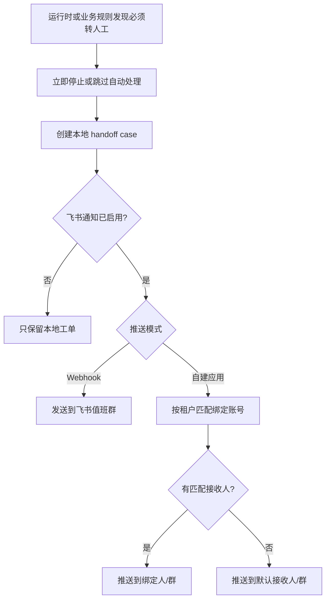

# 飞书转人工通知接入设计

## 目标

当微信自动客服触发不可继续自动处理的规则时，系统需要立刻停机保护、创建本地转人工工单，并把告警推送到飞书。

覆盖范围分两类：

1. 运行态不可逾越规则：微信掉线、登录页、白屏/空渲染、风控硬拦截、输入框连续不可用等。
2. 业务转人工规则：客户明确要求人工、商品库/正式知识库/RAG/LLM guard 判定必须人工、价格/合同/售后/同日交付等高风险承诺需要人工确认。

当前优先接入两种模式：

1. 群机器人 Webhook：适合先把所有转人工告警推到一个值班群，配置成本最低。
2. 自建应用机器人：适合按租户、账号、负责人绑定后精准推送到个人或指定群。

## 官方接口依据

飞书自定义机器人通过 Webhook 单向推送消息到指定群聊，安全设置支持签名校验。开启签名时，请求体需要带 `timestamp` 和 `sign`。
官方文档：https://open.feishu.cn/document/client-docs/bot-v3/add-custom-bot

自建应用机器人需要先通过 `POST /open-apis/auth/v3/tenant_access_token/internal` 获取 `tenant_access_token`，再调用 `POST /open-apis/im/v1/messages?receive_id_type=...` 发送文本消息。
官方文档：

- https://open.feishu.cn/document/server-docs/authentication-management/access-token/tenant_access_token_internal
- https://open.feishu.cn/document/server-docs/im-v1/message/create

## 配置项

系统设置页新增“飞书转人工通知”：

| 字段 | 用途 |
| --- | --- |
| enabled | 是否启用飞书通知 |
| mode | `webhook` 或 `app_bot` |
| webhook_url | 群机器人 Webhook 地址 |
| webhook_secret | 群机器人签名密钥 |
| app_id | 自建应用 App ID |
| app_secret | 自建应用 App Secret |
| receive_id_type | 默认接收 ID 类型 |
| default_receive_ids | 自建应用模式下的兜底接收 ID |
| bound_accounts | 按租户绑定接收人 |
| notify_on_handoff | 普通转人工是否通知 |
| notify_on_logout | 微信掉线/登录态异常是否通知 |

敏感字段不会回显明文。前端留空保存时，后端会保留已有密钥。

## 转人工流程

## 失败策略

飞书发送失败不能影响原始安全动作。微信掉线、风控停机等情况仍然必须先停止运行，再记录发送失败原因，等待人工处理。

## 验收点

1. 未配置飞书时，转人工工单仍可创建，状态为 `not_configured`。
2. Webhook 干跑时可生成合法 text 消息体，配置签名密钥时包含 `timestamp` 和 `sign`。
3. 自建应用模式会先获取 `tenant_access_token`，再按 `receive_id_type` 发送消息。
4. 同一小时内重复的运行态停机工单会去重，不重复轰炸飞书。
5. 业务转人工工单创建后会进入同一个飞书分发出口，重复工单不重复推送。
6. 系统设置页能保存、读取、测试飞书配置，且不泄露密钥明文。
