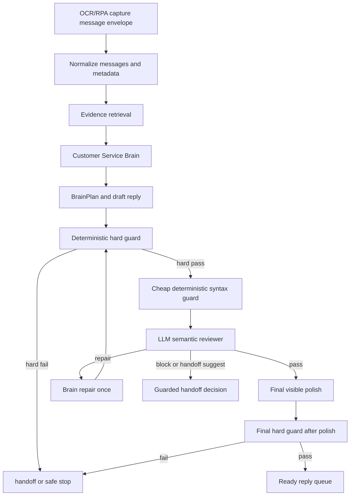

# LLM 语义质量门 V2 需求与架构

## 1. 问题定义

### 1.1 已确认的问题

在 Brain First 改造后，正常回复链路已经具备通用思考能力，但后置质量门仍存在以下缺陷：

- 质量门过度依赖静态字段和局部规则。
- 质量门对“语义是否答到点上”的判断能力不足。
- 质量门容易把合理回复误判为失败，触发错误 fallback 或转人工。
- 质量门无法区分“真事实越权”和“表达方式不符合固定规则”。
- 一些质量问题靠继续添加结构化分支修补，会破坏 Brain First 架构。

### 1.2 本轮目标

本轮目标是把质量门从“死规则裁判”升级为“硬边界守门员 + LLM 语义审稿人”：

- 保留不可妥协的确定性硬边界。
- 引入轻量 LLM 审稿，判断回复是否真正回应当前客户。
- 让质量门把问题反馈给 Brain 修复，而不是自己生成客户可见回复。
- 避免新增账号专属车型、价格、政策、销售话术硬编码。
- 在不降低回复质量的前提下，控制额外延迟。

### 1.3 非目标

本轮不做以下事情：

- 不改变商品库、正式知识库、AI 经验池的权威层级。
- 不让 LLM 审稿绕过事实 guard。
- 不让 LLM 审稿直接输出最终客户可见回复。
- 不为某个账号、某个车型、某个价格写死客服答案。
- 不取消最终可见润色。
- 不修改 RPA 多会话调度、窗口切换、OCR 捕获等底层动作策略。

## 2. 基础原则

### 2.1 权威层级

回复依据仍遵循既有层级：

1. 商品库：最高权威，负责商品名、别名、价格、库存、年份、里程、车况、地点、可售状态等商品事实。
2. 正式知识库：最高政策权威，负责流程、规则、风控边界、金融、置换、售后、合同、发票、转人工规则。
3. 当前会话事实：只在当前会话内有效，用于记住客户预算、用途、偏好、联系方式、已确认意向。
4. AI 经验池、历史聊天、话术风格、真实聊天样例：只做表达风格和经验参考，不授权事实。
5. LLM 常识：只做一般推理和表达组织，不授权商品事实或业务承诺。

### 2.2 Brain 主控

Brain 负责正常客服回复的核心工作：

- 理解客户真实意图。
- 识别上下文承接关系。
- 进行模糊实体理解和错别字联想。
- 判断哪些信息可以基于权威来源回答。
- 对无关闲聊做自然回应并软引导回业务。
- 对客户质疑、反问、追问、拒绝、犹豫做有温度的应对。
- 决定是否需要转人工。
- 规划短句、多段、完整语义的客户可见回复。

质量门不能替代 Brain 做客服决策。

### 2.3 硬边界不可被 LLM 覆盖

以下内容继续由确定性 guard 负责，且 LLM 审稿不能放行：

- 商品事实无权威来源。
- 价格、库存、车况、里程、地点、年份、可售状态与商品库冲突。
- 政策、金融、置换、合同、售后、发票、承诺与正式知识库冲突。
- 暴露自己是 AI、脚本、RPA、自动化、模型。
- 会话错位，目标会话和待发送回复不匹配。
- 空回复、截断回复、乱码回复、明显省略号截断。
- 高风险咨询需要转人工却未转。
- 客户可见回复绕过最终润色。

### 2.4 LLM 审稿只做语义质量判断

LLM 审稿负责判断这些软质量问题：

- 有没有直接回答客户这一轮真正问的问题。
- 是否错误沿用上一轮上下文，造成上下文漂移。
- 是否在客户已经给出条件后仍机械重复追问。
- 是否对明确选择题给了模棱两可的空话。
- 是否忽略客户补充信息，例如置换、贷款、预算、用途、车型偏好。
- 是否对无关闲聊过于生硬或答非所问。
- 是否该简短时说太多，该拆段时没有拆段。
- 是否把客户名字、群聊 sender、会话标题误当成正文。
- 是否多问题只回答了一部分。
- 是否对模糊车型名、错别字、别名没有合理联想。

LLM 审稿只能输出审稿结论和修复指令，不能输出最终客户回复。

## 3. 总体架构



## 4. 关键对象

### 4.1 BrainPlan

Brain 输出的结构化计划继续作为主对象：

- `reply_intent`
- `customer_intent`
- `evidence_refs`
- `fact_claims`
- `risk_flags`
- `handoff_recommendation`
- `draft_segments`
- `context_bindings`

### 4.2 QualityReviewRequest

语义审稿输入只包含审稿需要的最小上下文：

- 当前会话目标 ID 和显示名。
- 当前客户新消息。
- 最近几轮压缩上下文。
- BrainPlan 摘要。
- Brain draft reply。
- 已通过的权威证据摘要。
- 已触发或未触发的硬 guard 结果。
- 当前账号底层规则摘要。

不应把完整商品库、大量历史聊天、无关 OCR 原文全部塞入审稿 prompt。

### 4.3 QualityReviewResult

语义审稿输出只允许 JSON：

```json
{
  "verdict": "pass",
  "confidence": 0.92,
  "semantic_errors": [],
  "hard_boundary_concerns": [],
  "repair_instruction": "",
  "customer_visible_risk": "low",
  "reason": "The reply directly answers the current question and uses authorized product evidence."
}
```

可选 verdict：

- `pass`：语义质量通过。
- `repair`：需要 Brain 按指令修复。
- `block`：回复语义风险高，不应发送。
- `handoff_suggest`：建议转人工，但仍需硬规则二次确认。

## 5. 质量门分层

### 5.1 确定性硬 guard

必须保留在代码中，作为不可越权防线：

- authority guard
- product fact guard
- policy fact guard
- session isolation guard
- no AI exposure guard
- no truncated reply guard
- final polish required guard
- high-risk handoff guard

### 5.2 轻量确定性语法 guard

只做低成本、低争议的结构检查：

- 空文本。
- 过长且未拆段。
- 非法 JSON。
- 最终文本含明显截断符号。
- 多段数超过配置。
- 回复段落中出现明显系统字段名。

这些 guard 可以直接拦截或触发修复。

### 5.3 LLM 语义审稿

负责“人类客服感”的判断：

- 当前问题是否被回答。
- 回答是否和当前会话事实一致。
- 是否过度模板化。
- 是否过度转移话题。
- 是否对客户情绪缺乏回应。
- 是否该给明确建议时没有给。
- 是否重复问已经回答过的问题。
- 是否把辅助材料当成事实依据。

### 5.4 Brain 修复回路

当语义审稿返回 `repair` 时：

1. 把 `repair_instruction` 交回 Brain。
2. Brain 重新生成一次 BrainPlan 和 draft。
3. 再跑硬 guard。
4. 再跑语义审稿或只跑硬 guard，具体由配置决定。
5. 最多修复一次，避免延迟和循环。

## 6. 延迟策略

### 6.1 原则

第一优先级是不降低回复质量，第二优先级是提高回复速度。

因此不能为了速度取消 Brain、取消最终润色、或者让本地模板替代正常业务回复。

### 6.2 控制方式

- Brain prompt 保持短计划，减少无关历史和冗余证据。
- 语义审稿 prompt 更短，只审稿，不重新生成回复。
- 语义审稿输出限制在小 JSON。
- 语义审稿采用独立 timeout，建议默认 8 秒。
- 审稿失败时，硬 guard 已通过且风险低的回复可按配置进入 soft pass；高风险回复必须 block 或转人工。
- 对相同上下文和相同 draft 使用 digest cache。
- suspicious_only 模式下，只对可疑回复调用审稿，减少常规回复额外延迟。

### 6.3 推荐模式

- `shadow`：只记录审稿结果，不影响发送。
- `suspicious_only`：只审可疑回复，适合默认上线。
- `always`：所有回复都审，适合离线回归和高风险灰度。

## 7. 失败处理

### 7.1 LLM 审稿不可用

如果语义审稿超时或上游不可用：

- 硬 guard 未通过：不发送。
- 硬 guard 通过且风险低：按配置 soft pass，并记录 `semantic_reviewer_unavailable_soft_pass`。
- 硬 guard 通过但风险中高：触发 Brain safe fallback 或转人工。

### 7.2 Brain 修复仍失败

如果修复后仍未通过：

- 不回退到机械模板。
- 不强行发送低质量回复。
- 优先进入 Brain 安全兜底或转人工接口。
- Brain 安全兜底只能用于异常路径，不能成为正常业务回复捷径。
- 如果本轮 evidence pack 已有 `product_master` / `catalog_candidates` 权威候选，安全兜底可以生成最小证据锚定答复，只引用候选名称、商品库价格等已授权字段，避免空泛“稍后确认”。
- 如果没有权威证据，安全兜底只能使用短确认、边界说明或转人工接口，不得编造推荐。
- 安全兜底不得调用旧 realtime / RAG / local 模板，也不得写账号、车型、预算专属分支。
- 记录完整审计事件，便于后续优化。

## 8. 与 AI 经验池的关系

AI 经验池仍是信息入口和经验沉淀池，不参与事实授权。

质量门可读取 AI 经验池提供的表达风格和常见客户问法，但不能把 AI 经验池内容当成商品事实或正式政策。

如果语义审稿发现某类问题反复出现，可以生成内部观察项，进入 AI 经验池或候选知识流程，由后续知识治理决定是否沉淀为正式知识。

## 9. 与 AI 记录员的关系

本设计主要作用于微信智能客服客户可见回复链路。

AI 记录员不应复用客服回复质量门，但应继续共享以下底层规则：

- OCR speaker label 是元数据，不是正文。
- 会话标题、联系人名、群聊 sender 不得作为业务内容写入记录。
- 结构化导出必须保留原始证据来源，不能凭 LLM 常识补事实。
