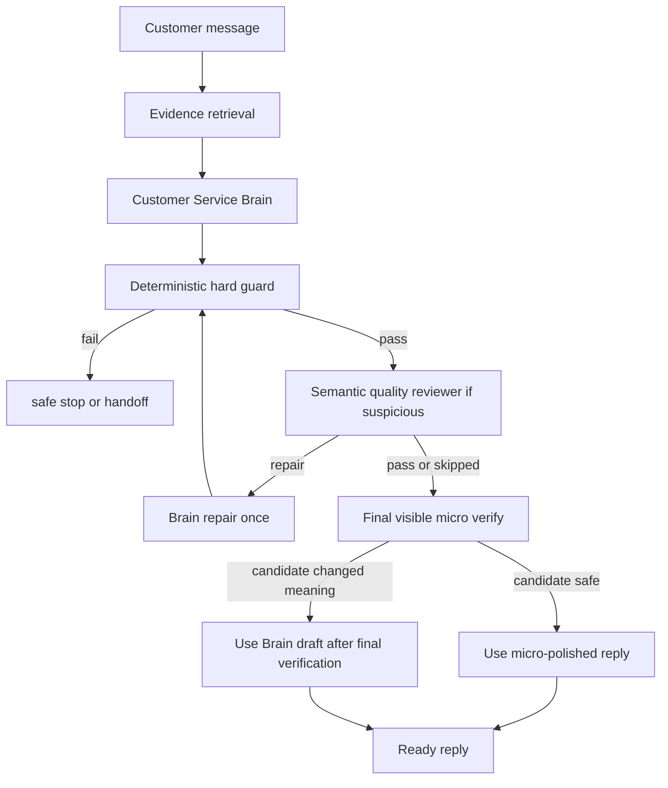

# Brain 与最终润色协同短链路

## 客户可见回复所有权硬基线

- 所有客户可见回复必须由 `customer_service_brain` 发出：只能是首个有效 BrainPlan、Brain repair 后的 BrainPlan，或 Brain 自己生成的硬边界/拒绝/转人工类说明。
- Guard、质量门、语义审稿、RAG、实时路由、本地模板、旧合成器、最终润色和任何兜底模块都不能生成、替换、拼接客户可见回复；它们只能提供证据、风险、审稿意见、返修指令或轻量表达校验。
- Brain 不可用、超时、不可采纳或返修失败时，不允许本地 safe fallback 代替 Brain 发客户可见话术；必须阻断发送、记录审计，并触发内部人工/告警接口。
- 后续所有客服相关开发文档必须引用 [customer_visible_reply_ownership_baseline.md](../customer_visible_reply_ownership_baseline.md)。

## 1. 背景

Brain First 改造后，正常客服回复已经由 LLM Brain 负责理解、判断、选证据、规划话术。继续让最终润色层以“完整改写器”的方式参与，会带来三个问题：

- Brain 已经做出正确决策后，润色层可能重新组织答案，导致答非所问或上下文漂移。
- 润色层可能误删车型、价格、边界词、否定承诺等关键语义。
- Brain、语义质量门、最终润色三个 LLM 环节都具备改写能力时，流程变长，也更容易模块打架。

因此本轮不取消最终可见层，而是把它从“二次写稿人”调整为“最终可见校验 + 微润色器”。

## 2. 新职责边界

### 2.1 Brain

Brain 是唯一正常客服回复主控：

- 理解客户本轮真实问题。
- 结合当前会话上下文做指代、追问、反问、质疑处理。
- 基于商品库和正式知识库决定可回答内容。
- 基于 LLM 常识处理低风险闲聊、常识问题和表达组织。
- 输出接近最终可发送的 `reply_segments`。

Brain 输出必须已经像真人微信客服短句，不再依赖润色层做大幅自然化。

### 2.2 语义质量门

语义质量门只负责审稿：

- 判断是否答到当前问题。
- 判断是否上下文漂移、机械追问、多问题漏答。
- 判断是否把常识/风格材料误当事实依据。
- 需要时给 Brain 一条修复指令。

语义质量门不生成客户可见回复，也不授权事实。

### 2.3 最终可见层

最终可见层仍必须执行，但 Brain 与 handoff/边界来源回复默认采用 `llm_micro_verify`：

- 默认原样返回 Brain 草稿。
- 只允许修错别字、标点、非常轻微口语顺滑。
- 禁止重新回答、重排顺序、扩写、删减结论。
- 禁止新增或删除车型、价格、库存、车况、政策、承诺、边界。
- 如果 LLM 微润色候选未通过语义保护 guard，采用 Brain 原草稿并记录审计。
- 如果 handoff 原稿包含负责人、顾问、专员、核实、确认、预审、审核等人工核验语义，微润色候选必须保留。

这保证“最终可见层仍在”，但不再和 Brain 抢主控权。

## 3. 运行流程



## 4. 配置

推荐配置：

```json
{
  "final_visible_llm_polish": {
    "enabled": true,
    "required_for_send": true,
    "brain_source_policy": "llm_micro_verify",
    "handoff_source_policy": "llm_micro_verify",
    "micro_verify_source_channels": ["brain", "handoff"],
    "brain_micro_guard_fallback_to_draft": true,
    "brain_micro_timeout_seconds": 5,
    "brain_micro_max_tokens": 80,
    "brain_micro_temperature": 0.25,
    "brain_micro_min_similarity": 0.72
  }
}
```

配置说明：

- `brain_source_policy=llm_micro_verify`：Brain 来源回复进入最终微润色/校验模式。
- `handoff_source_policy=llm_micro_verify`：转人工/边界来源回复也进入最终微润色/校验模式。
- `micro_verify_source_channels`：默认保护 `brain` 和 `handoff` 两类来源。
- `brain_micro_guard_fallback_to_draft=true`：微润色候选被 guard 拒绝时，用 Brain 原稿而不是阻断整条安全回复。
- `brain_micro_timeout_seconds`：微润色 LLM 预算，默认 5 秒。
- `brain_micro_max_tokens`：微润色输出预算，默认 80。
- `brain_micro_temperature`：低温，减少自由改写。
- `brain_micro_min_similarity`：微润色候选和 Brain 原稿的最低相似度。

## 5. 常识问题的质量门策略

LLM 常识可以回答低风险的一般问题，例如：

- 自己剐蹭或撞墙后保险一般怎么处理。
- 无伤大雅的闲聊。
- 车辆类型、用车场景、保值率等泛化取舍。

但必须满足：

- 不做具体赔付、金融、政策、商品事实承诺。
- 使用“一般、通常、不一定、以保单/保险公司审核为准”等边界词。
- 商品事实仍回到商品库，业务政策仍回到正式知识库。

语义质量门不应把这类带边界的常识回答误杀为“必须正式知识授权”。

## 6. 回滚

如果实盘发现最终微润色太保守，可以临时回滚为旧改写模式：

```json
{
  "final_visible_llm_polish": {
    "brain_source_policy": "rewrite"
  }
}
```

不建议关闭 `final_visible_llm_polish.enabled`，因为最终可见层仍是客户可见文本的最后一道防线。

## 7. 验收标准

- Brain 回复不再被最终润色改成另一个话题。
- Handoff/边界回复不再被最终润色磨掉负责人、顾问、专员、核实、确认等人工核验语义。
- 微润色候选如果删除车型、价格、否定边界，必须被拒绝。
- 被拒绝后能采用 Brain 原稿继续发送，不触发无意义阻断。
- 常识类保险问题能谨慎回答，不误转人工，不保证赔付。
- 最终可见层仍有审计字段，能看出是 `brain_micro` 还是普通润色。
- 回复速度比完整二次改写更稳定，尾延迟下降。
