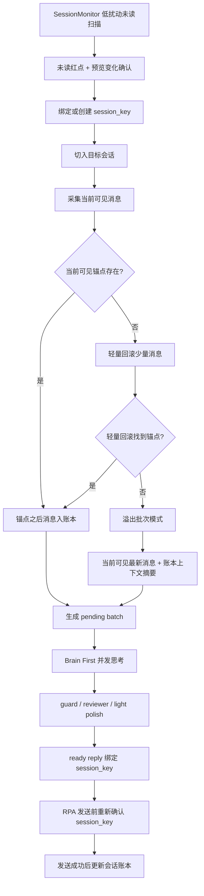

# RPA 会话唯一身份与会话账本开发文档（2026-06-07）

## 客户可见回复所有权硬基线

- 所有客户可见回复必须由 `customer_service_brain` 发出：只能是首个有效 BrainPlan、Brain repair 后的 BrainPlan，或 Brain 自己生成的硬边界/拒绝/转人工类说明。
- Guard、质量门、语义审稿、RAG、实时路由、本地模板、旧合成器、最终润色和任何兜底模块都不能生成、替换、拼接客户可见回复；它们只能提供证据、风险、审稿意见、返修指令或轻量表达校验。
- Brain 不可用、超时、不可采纳或返修失败时，不允许本地 safe fallback 代替 Brain 发客户可见话术；必须阻断发送、记录审计，并触发内部人工/告警接口。
- 后续所有客服相关开发文档必须引用 [customer_visible_reply_ownership_baseline.md](customer_visible_reply_ownership_baseline.md)。

## 1. 背景

当前微信智能客服已经切换到纯 RPA + OCR + Brain First 主线。多会话实测中暴露出两个底层问题：

1. 当客户连续刷很多消息，把上一条已处理锚点顶出当前可见页面时，系统容易触发 `history_backfill_gap_risk`，导致识别到会话但不回复。
2. 当前多处逻辑仍以显示名作为会话身份，例如 `许聪`。当私聊会话叫 `许聪`，群聊里发言人也叫 `许聪`，或未来出现两个同名联系人时，仅靠显示名无法保证消息、Brain 输入、回复队列和发送目标不串会话。

这两个问题本质上都是同一个架构缺口：系统过度依赖当前微信 UI 画面和显示名称，缺少稳定的会话身份与本地会话账本。

## 2. 核心目标

1. 建立 `session_key` 作为会话唯一身份，显示名只作为展示字段。
2. 建立本地会话账本，按 `session_key` 保存已捕获消息、已回复位置、上下文摘要和待处理批次。
3. 将 UI 历史回滚从主流程降级为补救手段，减少机械上翻和白屏/风控风险。
4. 当锚点不可见时，先做轻量回滚查找；仍找不到时进入新批次模式，但必须继续回复。
5. 保证多会话并发下消息采集、Brain 思考、回复排队、RPA 发送全链路绑定同一个 `session_key`。
6. 不改变 Brain First 客服回复架构，不把回复质量问题重新拉回结构化模板路线。

## 3. 非目标

1. 不重写 Brain First、guard、final polish 架构。
2. 不引入 wxauto4 作为主路径。
3. 不通过硬编码联系人、车型、话术来解决会话错位或回复质量问题。
4. 不要求 RPA 完全不回滚。回滚仍作为少量、拟人、安全的补采手段存在。
5. 不把本地账本作为商品事实或正式知识来源。账本只保存当前会话上下文和调度状态。

## 4. 设计原则

### 4.1 会话账本为第一依据

正常情况下，程序应优先依赖本地会话账本判断：

1. 当前会话最后处理到哪条消息。
2. 当前会话最后回复到哪条消息。
3. 哪些消息已进入 Brain 思考。
4. 哪些回复已准备发送但尚未发送。

UI 画面只负责增量采集、轻量补采与发送确认，不应每次都靠上翻寻找历史。

执行优先级必须是：

1. `session_key` 对应的会话账本与 summary。
2. 当前可见 UI 消息增量。
3. 有界轻量回滚补采。
4. 现有 RPA 临时记录和旧 workflow state 作为兼容兜底。

这能兼容旧链路，同时减少前台动作，提升性能和稳定性。

### 4.2 轻量回滚优先

当当前屏幕找不到上一条已处理锚点时，不应立即失败。

正确顺序是：

1. 先在当前可见消息中查找锚点。
2. 找不到时，轻量往回滚少量几条消息，优先找回丢失锚点。
3. 如果轻量回滚仍找不到，则进入溢出批次模式，按当前可见新消息和本地会话账本推断合理回复。

轻量回滚必须有上限，不允许机械反复上翻。

### 4.3 找不到锚点也必须回复

找不到锚点只能说明 UI 可见历史不完整，不能直接等同于不能回复。

如果客户刷屏导致锚点不可见，系统应理解为一个新的未读消息批次：

1. 尽量读取当前屏幕可见的最新客户消息。
2. 结合本地账本中的历史上下文摘要。
3. 交给 Brain 判断是否能直接回复。
4. 如果上下文确实不足，让 Brain 自然追问确认。

除非出现登录失效、白屏、目标会话无法确认、硬安全边界等不可逾越问题，否则不能沉默。

### 4.4 会话身份不能等于显示名称

`display_name` 只是展示名，不能作为调度主键。

必须区分：

1. `session_key`：系统内部唯一身份。
2. `display_name`：侧边栏显示名。
3. `chat_title`：当前聊天窗口标题。
4. `conversation_type`：私聊、群聊或未知。
5. `speaker_name`：群聊发言人或 OCR 识别出的发言标签。
6. `row_fingerprint`：侧边栏会话行的视觉指纹。

群聊里的发言人名称是消息元数据，绝不能作为目标会话身份。

### 4.5 Brain First 不变

本次改造只解决 RPA 会话识别、上下文账本、锚点补救和多会话绑定问题。

客户可见回复仍由 Brain 负责理解、判断、取证、规划和表达。账本提供稳定上下文，不接管回复决策。

## 5. 新架构概览



## 6. 数据模型

### 6.1 会话身份

建议新增或扩展会话状态字段：

```json
{
  "session_key": "wx:rpa:v1:...",
  "display_name": "许聪",
  "chat_title": "许聪",
  "conversation_type": "private",
  "row_fingerprint": {
    "title_text": "许聪",
    "title_bbox": [98, 193, 252, 233],
    "avatar_hash": "optional",
    "row_y_bucket": 2,
    "last_preview_digest": "optional",
    "last_unread_badge_bbox": [139, 194, 147, 202]
  },
  "aliases": [],
  "created_at": "2026-06-07T00:00:00+08:00",
  "updated_at": "2026-06-07T00:00:00+08:00"
}
```

`session_key` 的生成原则：

1. 优先使用稳定绑定信息，例如手动绑定后的内部 ID。
2. 没有稳定 ID 时，使用 `conversation_type + chat_title + row_fingerprint` 生成临时 key。
3. 检测到同名或指纹不稳定时，不自动合并。
4. 同名会话必须进入歧义保护，不允许只靠显示名发送。

### 6.2 会话账本

建议以 JSONL 或 SQLite 落地。第一阶段可使用 JSONL，方便审计和回放；稳定后可迁移 SQLite。

目录建议：

`runtime/wechat_ai_customer_service/session_ledgers/{account_id}/{session_key}.jsonl`

每条消息事件建议结构：

```json
{
  "event_id": "msg_...",
  "session_key": "wx:rpa:v1:...",
  "event_type": "message_captured",
  "message_id": "ocr_...",
  "message_role": "customer",
  "display_name": "许聪",
  "speaker_name": "",
  "conversation_type": "private",
  "content": "晚上好，想看看有没有奥迪",
  "content_digest": "sha256:...",
  "captured_at": "2026-06-07T00:00:00+08:00",
  "visible_position": {
    "screen": "current",
    "bubble_bbox": [0, 0, 0, 0]
  },
  "source": "rpa_ocr"
}
```

会话摘要状态建议结构：

```json
{
  "session_key": "wx:rpa:v1:...",
  "last_captured_message_id": "ocr_...",
  "last_processed_message_id": "ocr_...",
  "last_replied_message_id": "ocr_...",
  "last_successful_reply_digest": "sha256:...",
  "context_summary": "客户想看奥迪，预算暂未明确，关注车况和价格。",
  "pending_batches": [],
  "risk_state": {
    "last_anchor_status": "found|light_backfill_found|overflow_batch|failed",
    "last_anchor_checked_at": "2026-06-07T00:00:00+08:00"
  }
}
```

## 7. 消息采集算法

### 7.1 正常增量采集

输入：

1. `session_key`
2. 当前可见消息列表
3. 本地账本中的 `last_processed_message_id`
4. 本地账本中的 `last_replied_message_id`
5. 内容 digest 锚点

流程：

1. OCR 读取当前可见消息。
2. 去除 OCR/RPA 元数据污染，例如群成员名、聊天标题、时间标签。
3. 在当前可见消息中查找本地账本锚点。
4. 如果找到锚点，只提取锚点之后的新客户消息。
5. 新消息写入账本，形成 pending batch。

### 7.2 轻量回滚

触发条件：

1. 当前会话由未读红点触发。
2. 当前可见消息没有找到本地账本锚点。
3. 当前可见消息存在疑似客户新消息。

建议默认参数：

```json
{
  "light_backfill_enabled": true,
  "light_backfill_max_scroll_steps": 2,
  "light_backfill_max_duration_seconds": 4,
  "light_backfill_min_delay_ms": 260,
  "light_backfill_max_delay_ms": 780,
  "light_backfill_wheel_units_min": 2,
  "light_backfill_wheel_units_max": 4
}
```

要求：

1. 每次滚动幅度要小，避免大幅机械上翻。
2. 滚动间隔带随机抖动。
3. 找到锚点立刻停止。
4. 超过上限立刻停止，不进入深度机械搜索。

### 7.3 溢出批次模式

如果轻量回滚仍找不到锚点，进入溢出批次模式。

溢出批次不是失败，而是可回复状态。

处理方式：

1. 读取当前可见最新客户消息。
2. 与本地账本最近上下文摘要合并。
3. 标记 `history_continuity = "overflow_unanchored"`。
4. 把可见新消息作为一个新的 batch 交给 Brain。
5. Brain 必须知道当前可能缺少部分上文，必要时自然追问。

Brain 输入中应明确包含：

```json
{
  "history_continuity": "overflow_unanchored",
  "instruction": "当前客户可能连续刷屏，旧锚点不可见。请基于可见新消息和本地会话摘要回复；如上下文不足，请自然追问，不要沉默。"
}
```

### 7.4 不允许沉默的规则

以下情况必须产生一个可执行结果：

1. 正常回复。
2. 自然追问。
3. 明确转人工。
4. 明确安全停机。

单纯因为找不到历史锚点，不允许直接不回复。

## 8. 多会话绑定与防错发

### 8.1 全链路绑定字段

以下对象必须携带 `session_key`：

1. `SessionMonitor` 的 dispatch event。
2. capture request。
3. capture result。
4. pending batch。
5. Brain input。
6. Brain result。
7. guard/reviewer result。
8. ready reply。
9. send request。
10. send audit event。

### 8.2 发送前确认

发送前必须确认：

1. 当前激活会话的 `chat_title` 与目标会话匹配。
2. 当前会话的 `session_key` 或绑定指纹与 ready reply 一致。
3. 群聊发言人名不能作为目标会话确认依据。
4. 如果存在同名会话且无法确认唯一身份，禁止发送，转入歧义保护。

### 8.3 同名会话歧义保护

检测到以下情况时进入歧义保护：

1. 会话列表中出现多个相同 `display_name`。
2. 私聊名称与群聊发言人名称相同。
3. 同一 `display_name` 的 `row_fingerprint` 在短时间内变化过大。
4. 发送前只能确认显示名，不能确认 `session_key`。

歧义保护策略：

1. 不自动猜测目标。
2. 不发送客户可见回复。
3. 在控制台提示需要重新识别或人工绑定。
4. 记录审计事件，便于后续复盘。

## 9. 与 Brain First 的关系

会话账本只提供上下文，不改变决策权。

Brain 仍然负责：

1. 判断客户真实意图。
2. 结合商品库和正式知识库作答。
3. 根据上下文处理追问、质疑、闲聊、告别和异议。
4. 在溢出批次模式下判断是否能直接回复，或是否需要自然追问。

会话账本不能：

1. 编造商品事实。
2. 覆盖商品库和正式知识库。
3. 生成结构化模板式回答。
4. 绕过 guard 和最终可见轻润色。

## 10. 实施计划

### Phase 1：数据契约与兼容层

1. 增加 `session_key` 数据结构。
2. 保留旧 `target_name` 字段作为展示和兼容字段。
3. 新增会话账本读写模块。
4. 为旧状态文件提供迁移兼容逻辑。

验收：

1. 旧配置不崩。
2. 新状态中每个会话都有 `session_key`。
3. 同名会话不会被合并成同一个内部状态。

### Phase 2：SessionMonitor 绑定 session_key

1. 未读红点 + 预览确认后，输出 `session_key`。
2. 会话列表扫描时生成或更新 `row_fingerprint`。
3. 群聊 speaker metadata 不参与会话身份生成。

验收：

1. `新数据测试` 群聊中 `许聪` 发言，不会被绑定到私聊 `许聪`。
2. 两个同名会话会被标记为歧义，而不是自动合并。

### Phase 3：账本驱动的消息采集

1. capture 后先查本地账本锚点。
2. 当前屏幕找到锚点时，不回滚。
3. 当前屏幕找不到时，执行轻量回滚。
4. 轻量回滚失败时进入溢出批次模式。

验收：

1. 刷屏导致旧锚点不可见时，仍然能回复。
2. 轻量回滚次数和耗时受控。
3. `history_backfill_gap_risk` 不再直接导致沉默。

### Phase 4：Brain 输入与上下文摘要

1. Brain input 增加 `session_key`、`history_continuity`、`context_summary`。
2. 成功回复后更新会话摘要。
3. 溢出批次模式下明确告知 Brain 上下文可能不完整。

验收：

1. 刷屏场景下 Brain 能基于上下文合理回复。
2. 上下文不足时 Brain 会自然追问，不答非所问。

### Phase 5：发送队列防错发

1. ready reply 必须绑定 `session_key`。
2. 发送前复核当前 active session。
3. 同名歧义时 fail closed，不发送。

验收：

1. 多会话并发下不把 A 的回复发给 B。
2. 私聊 `许聪` 与群聊 speaker `许聪` 不串。
3. 发送失败或确认失败时有明确审计事件。

## 11. 测试计划

### 11.1 离线单元测试

1. `session_key` 生成稳定性。
2. 同名会话不合并。
3. 群聊 speaker metadata 不参与 target identity。
4. 当前可见锚点命中时不回滚。
5. 轻量回滚找到锚点时正常生成 batch。
6. 轻量回滚找不到锚点时进入溢出批次模式。
7. 溢出批次模式必须输出 reply / ask / handoff / stop 之一。
8. ready reply 与 send request 的 `session_key` 一致性。

### 11.2 模拟集成测试

1. 单会话连续消息，锚点可见。
2. 单会话刷屏，锚点不可见，轻量回滚找到。
3. 单会话刷屏，轻量回滚也找不到，仍回复。
4. 两会话同时未读，Brain 并发，回复按 ready 队列发送。
5. 私聊 `许聪` 与群聊 `新数据测试` 中 speaker `许聪` 同时出现。
6. 两个同名私聊模拟，进入歧义保护。

### 11.3 实盘灰度测试

1. `文件传输助手` 自问自答刷屏测试。
2. `许聪` 与 `新数据测试` 两会话并发测试。
3. 刻意让锚点被顶出屏幕后测试是否仍回复。
4. 观察 UI 行为日志，确认不出现深度机械回滚。
5. 观察发送审计，确认所有发送前后 `session_key` 一致。

## 12. 风险与兜底

### 12.1 账本与真实微信状态不一致

风险：本地账本认为已处理，但微信中实际消息状态不同。

兜底：

1. 每次未读红点触发仍以当前可见消息为准。
2. 账本只做辅助上下文和锚点，不压制真实新消息。
3. 内容 digest 去重，避免重复回复。

### 12.2 OCR 误识别导致消息污染

风险：OCR 把用户名、时间、聊天标题识别为正文。

兜底：

1. 继续使用 message envelope/normalizer。
2. speaker/title/time 全部作为 metadata。
3. customer visible content 单独字段进入 Brain。

### 12.3 同名会话无法自动区分

风险：两个同名私聊且 row fingerprint 不稳定。

兜底：

1. 进入歧义保护。
2. 控制台提示人工绑定。
3. 不猜测、不发送。

### 12.4 溢出批次上下文不足

风险：客户刷屏太多，当前可见消息不是完整问题。

兜底：

1. Brain 使用会话摘要补上下文。
2. 仍不足时自然追问。
3. 不直接沉默。

## 13. 验收标准

1. 锚点可见时，0 次无谓回滚。
2. 锚点不可见但轻量回滚可找到时，能继续回复。
3. 锚点不可见且轻量回滚找不到时，进入溢出批次模式并回复或自然追问。
4. 多会话并发下，消息、Brain 输入、ready reply、send request 全部 `session_key` 一致。
5. 私聊名与群聊 speaker 同名时，不串会话。
6. 同名会话无法唯一确认时，不错发，进入歧义保护。
7. 实盘测试中不出现深度机械上翻。
8. 不破坏 Brain First，客户可见回复仍由 Brain 主导。

## 14. 后续可选增强

1. 将 JSONL 账本迁移到 SQLite，提升并发读写和查询能力。
2. 增加会话绑定 UI，让用户手动确认同名会话。
3. 增加账本回放工具，用真实历史消息重放多会话错位场景。
4. 增加可视化审计面板，展示每条回复从 capture 到 send 的 `session_key` 链路。
5. 对长会话做滚动摘要压缩，控制 Brain 输入长度和响应速度。
