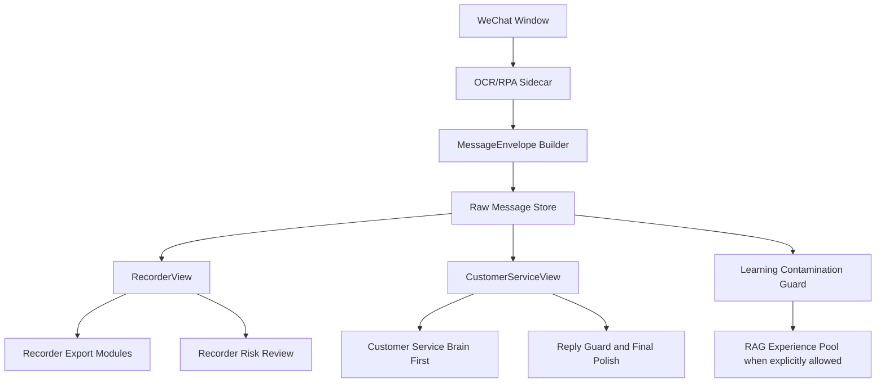

# 微信 AI 记录员 OCR 消息信封与智能客服协同改造开发文档

版本：2026-06-04

适用范围：`apps/wechat_ai_customer_service`

目标模块：

- 微信 AI 记录员
- 微信智能客服
- 共享 WeChat OCR/RPA 采集底座
- 共享原始消息库与学习污染门禁

## 1. 背景

当前 WeChat 采集链路从 `wxauto4` 结构化读取逐步扩展到 `OCR + RPA` 识图兜底。这个方向提升了新版微信兼容性，但也引入了新的质量风险：

- OCR 可能把群聊发送人姓名识别进消息正文。
- OCR 可能把长按历史记录、引用消息、灰色预览区识别进当前消息。
- OCR 当前主要按“同侧 + 垂直距离”合并文本行，容易把多个聊天气泡混成一条消息。
- 记录员导出和 LLM 抽取直接消费 `content`，一旦 `content` 被污染，后续抽取会把噪声当作订单事实。
- 秒级时间需求不能依赖 OCR 看到的聊天窗口时间，应以程序实际读到该消息的时间为准。
- 记录员和智能客服共用 OCR sidecar、消息归一化、原始消息库、学习门禁；如果把记录员专用规则直接写死到共享层，可能影响智能客服正常理解多气泡上下文和引用上下文。

因此本次改造的核心不是继续堆叠订货表专用规则，而是升级共享采集契约：让底座输出结构化、可审计、可分模块消费的消息信封，然后由记录员和智能客服分别使用自己的视图。

## 2. 总体目标

### 2.1 产品目标

- 记录员只记录真实当前消息正文，不把群成员名、引用历史、长按历史、系统浮层等噪声送入订单抽取。
- 记录员导出表格使用程序实际读到消息的秒级时间。
- 记录员对明显有误或证据不足的订单行强制打高风险，便于人工复核。
- 智能客服继续保留多气泡语义理解能力，不被记录员的“一气泡一订单范围”限制。
- 智能客服仍可使用引用内容辅助理解当前问题，但引用内容不能被误当作新消息或可学习事实。
- 记录员默认只做记录与导出，不自动把消息写入 RAG 经验池；需要学习时必须显式开启并经过污染门禁。

### 2.2 工程目标

- 建立统一 `MessageEnvelope` 数据契约。
- 在 OCR sidecar 层保留几何证据、OCR 原文、清洗正文、引用片段、质量标志。
- 在原始消息库中兼容旧字段，同时新增可靠字段。
- 让 `RecorderView` 和 `CustomerServiceView` 从同一信封派生，业务策略互不污染。
- 增加单元测试、集成测试、回归测试，覆盖 OCR 噪声、引用、气泡边界、秒级时间、风险标志和客服多气泡理解。

## 3. 非目标

- 本次不重新设计实验仪器订货表的全部业务抽取规则。
- 本次不依赖 OCR 识别聊天窗口中的时间作为事实时间。
- 本次不把记录员采集内容默认升级为正式知识或 RAG 经验。
- 本次不改微信发送防风控策略，除非测试暴露与消息信封相关的必要调整。
- 本次不删除历史字段，避免破坏旧数据和已有导出任务。

## 4. 当前代码诊断

### 4.1 OCR 消息解析

文件：`apps/wechat_ai_customer_service/adapters/wechat_win32_ocr_sidecar.py`

当前 `parse_messages_from_ocr` 主要流程：

- 过滤头部、底部输入区、左侧会话栏。
- 按 OCR item 的左右位置判断 `self` 或 `unknown`。
- 按 `center_y` 排序。
- 如果上一行和当前行同侧，并且垂直距离小于阈值，就合并为同一消息。
- 输出 `content`、`sender`、`sender_role`、`ocr_confidence`。

问题：

- 没有真正识别微信气泡矩形。
- 没有区分“群成员名行”和“气泡正文”。
- 没有区分“引用/历史预览”和“当前消息正文”。
- 没有输出 `bubble_id`、`bubble_rect`、`excluded_fragments`、`quality_flags`。
- 多个相邻气泡容易被合并。

### 4.2 文本归一化

文件：`apps/wechat_ai_customer_service/wechat_message_normalizer.py`

当前已有 `split_wechat_ocr_speaker_prefix`，可把类似 `许聪\n在不在` 拆成 `speaker_name=许聪` 和 `content=在不在`。

优点：

- 已经开始把群成员名从正文剥离。
- 保留了 `original_content` 和 `ocr_speaker_prefix` 审计信息。

问题：

- 主要依赖文本形态判断，缺少 OCR 几何证据。
- 对实验仪器场景里“短品牌词 + 产品正文”和“短人名 + 消息正文”仍可能混淆。
- 不能处理引用预览、长按历史浮层、多个气泡混合。

### 4.3 原始消息入库

文件：`apps/wechat_ai_customer_service/admin_backend/services/raw_message_store.py`

当前入库字段包含：

- `content`
- `message_time`
- `observed_at`
- `source_adapter`
- `ocr_speaker_prefix`
- `learning_enabled`
- `excluded_reason`
- `raw_payload`

问题：

- 没有独立 `captured_at`。
- `message_time` 仍可能来自 OCR/RPA 外部字段。
- 导出和筛选使用 `message_time or observed_at`，可能被不可靠 `message_time` 带偏。
- 没有保存 `content_clean`、`raw_ocr_text`、`quoted_fragments`、`bubble_rect`、`quality_flags` 等一等公民字段。

### 4.4 记录员导出

文件：`apps/wechat_ai_customer_service/admin_backend/services/recorder_export_run_service.py`

当前具备：

- 订单表头包含“日期”和“时间”。
- LLM 抽取、规则抽取、品牌推断、行级修复、颜色标注。
- `confidence` 与 `needs_review`。

问题：

- 导出时间仍用 `message_time or observed_at`。
- `_extract_product_name` 对 `[引用...]` 的处理会从引用内容中提取产品，这与当前需求相反。
- `confidence` 是字段完整度加分制，不足以处理“字段看似完整但来源污染”的情况。
- 缺少 `risk_flags`，不能表达引用污染、边界不清、群成员名进入正文等硬风险。

### 4.5 学习与 RAG

文件：

- `apps/wechat_ai_customer_service/admin_backend/services/recorder_service.py`
- `apps/wechat_ai_customer_service/admin_backend/services/knowledge_contamination_guard.py`

当前记录员默认 `auto_learn=True`，新增消息可以进入学习 batch。污染门禁已排除 self、测试标记、模型回复、非文本等内容。

问题：

- 记录员产品语义上应默认只记录与导出，不应自动进入 RAG 经验池。
- OCR 噪声、引用污染、气泡边界不清尚未作为学习排除理由。
- 如果不改，记录员 OCR 噪声仍可能流入候选知识链路。

## 5. 核心设计原则

### 5.1 共享底座只做识别和标注

共享层不写记录员专用业务规则，不判断“这是不是实验仪器订单”，只负责：

- 当前气泡正文是什么。
- 群成员名是什么。
- 哪些片段是引用/历史/浮层，应排除出正文。
- OCR 置信度和边界质量如何。
- 程序实际读取时间是什么。

### 5.2 分模块消费

同一个 `MessageEnvelope` 派生两个视图：

- `RecorderView`：严格、保守、单气泡范围、忽略引用。
- `CustomerServiceView`：保留多气泡语义 batch、引用作为辅助上下文、继续走 Brain First。

### 5.3 证据链优先于模型猜测

LLM 只能在干净正文和明确上下文中抽取结构化信息。任何来自引用、群成员名、边界不清区域的内容都不能作为高置信事实。

### 5.4 新字段优先，旧字段兼容

新增 `captured_at`、`content_clean` 等字段，旧数据继续可读。导出逻辑优先新字段，缺失时回退旧字段。

## 6. 目标架构



## 7. MessageEnvelope 数据契约

### 7.1 字段定义

| 字段 | 类型 | 说明 | 记录员使用 | 客服使用 |
| --- | --- | --- | --- | --- |
| `message_id` | string | 来源消息 ID 或生成 ID | 是 | 是 |
| `bubble_id` | string | 气泡级稳定 ID | 是 | 是 |
| `conversation_id` | string | 会话 ID | 是 | 是 |
| `target_name` | string | 会话名称 | 是 | 是 |
| `conversation_type` | string | `private/group/file_transfer` | 是 | 是 |
| `sender_role` | string | `self/group_member/unknown/customer` | 是 | 是 |
| `speaker_name` | string | 群成员名，仅元数据 | 不进正文 | 可用于理解说话人 |
| `content_body` | string | 当前气泡正文，已排除发送人和引用 | 导出主输入 | 回复主输入 |
| `content_raw_ocr` | string | OCR 原始文本 | 审计 | 审计 |
| `original_content` | string | 兼容旧字段 | 审计 | 审计 |
| `quoted_fragments` | array | 引用/历史预览内容 | 忽略 | 辅助上下文 |
| `excluded_fragments` | array | 被排除片段及原因 | 风险依据 | 低权重上下文 |
| `bubble_rect` | object | 气泡矩形 | 边界质量 | freshness/debug |
| `ocr_items` | array | OCR item 摘要 | 调试 | 调试 |
| `ocr_confidence` | number | 最低或加权置信度 | 风险依据 | 风险依据 |
| `quality_flags` | array | OCR/边界/污染风险 | 强制复核 | 调度保护 |
| `captured_at` | string | 程序实际读到时间，秒级 | 日期/时间权威来源 | freshness 权威来源 |
| `screen_time_text` | string | 屏幕可见时间，仅审计 | 不参与导出 | 不参与 freshness |
| `source_adapter` | string | `wxauto4/win32_ocr` | 是 | 是 |
| `source_payload` | object | 来源调试信息 | 审计 | 审计 |

### 7.2 字段兼容

保存到旧 raw message 时：

- `content = content_body`
- `message_time = captured_at`，仅对 OCR/RPA 来源强制如此
- `observed_at = captured_at`，若未显式提供
- `raw_payload.message_envelope = MessageEnvelope`

旧数据读取时：

- 若没有 `captured_at`，使用 `observed_at`
- 若没有 `content_body`，使用 `content`
- 若没有 `quality_flags`，按旧数据视为未知质量，不强制红色

## 8. OCR 解析策略

### 8.1 气泡边界

优先目标是识别气泡矩形。可按以下策略组合：

- 利用 OCR item 的背景区域、左右边界、文本聚类、颜色差异推断气泡。
- `self` 消息和对方消息分别建立候选区域。
- 只有同一个气泡矩形内的 OCR item 才能合并为一个 `content_body`。
- 不允许仅靠“同侧 + 垂直距离”跨气泡合并。
- 如果无法确定气泡边界，允许保守退化为旧逻辑，但必须打 `bubble_boundary_ambiguous`。

### 8.2 群成员名识别

群成员名应满足：

- 位于对方气泡上方或左上方。
- 与气泡正文在几何上分离。
- 短文本、无价格、无数量、无明显产品单位、无型号特征。
- 可以保存在 `speaker_name/group_member_name`。
- 不进入 `content_body`。

如果 OCR 已经把群成员名和正文合并为一段，归一化层可二次拆分，但需要写入 `quality_flags=["speaker_prefix_split_from_ocr_text"]`。

### 8.3 引用与历史内容

引用/历史内容特征：

- 文本包含 `[引用]`、`引用`、`回复` 等显式标记。
- 灰色预览块、长按历史浮层、复制/转发/收藏等操作面板附近文本。
- 明显重复旧消息内容且位置不在当前气泡正文区域。

处理原则：

- 从 `content_body` 中移除。
- 存入 `quoted_fragments` 或 `excluded_fragments`。
- 记录员导出忽略。
- 智能客服可作为 `referenced_context` 辅助理解，但不得直接学习为事实。

### 8.4 时间来源

程序读取 OCR 页面并生成消息信封时，应立即生成：

```text
captured_at = datetime.now().isoformat(timespec="seconds")
```

屏幕时间：

- 可以 OCR 保存为 `screen_time_text`
- 不参与记录员日期/时间
- 不参与导出筛选
- 不参与客服 freshness/gap-risk 权威判断

## 9. 分模块视图

### 9.1 RecorderView

输入：

- `content_for_export = content_body`
- `captured_at`
- `quality_flags`
- `speaker_name` 仅作为排除依据
- `quoted_fragments` 不进入 LLM prompt

规则：

- 一个气泡是一个订单语义范围。
- 一个气泡内可以根据 `元`、品牌、产品、数量、价格拆成多行。
- 不同气泡之间不得串用品牌、规格、产品、价格。
- 姓名上下文可以引用最近 1 到 3 条、5 分钟内的消息，但只用于购买人/老师，不用于品牌或产品。
- 引用内容不能作为产品、品牌、规格、价格、姓名证据。
- 若气泡边界不清或引用污染，导出行强制黄色或红色。

### 9.2 CustomerServiceView

输入：

- `content_for_reply = content_body`
- `referenced_context = quoted_fragments`
- `speaker_name`
- `captured_at`
- `quality_flags`

规则：

- 多个相邻客户气泡可以按时间窗口合成一个语义 batch。
- 引用内容可以作为“用户当前问题的上下文”，例如“这个还有吗”的“这个”。
- 引用内容不能直接成为新事实，不能进入自动学习。
- 继续使用 Brain First 架构：理解、计划、证据、guard、final polish。
- RPA 发送前仍需确认当前会话匹配目标。

## 10. 学习与 RAG 策略

### 10.1 记录员默认策略

记录员默认：

```text
auto_learn = false
learning_enabled = false for source_module=smart_recorder
```

如果后台允许某账号开启记录员学习，也必须满足：

- `content_body` 非空。
- 无 `quote_contamination`。
- 无 `bubble_boundary_ambiguous`。
- 无 `ocr_low_confidence`。
- 无 `sender_name_in_content`.
- 人工确认后才允许进入经验层。

### 10.2 智能客服策略

智能客服可继续使用经验层，但必须遵守已有权威边界：

- 产品事实来自商品主数据。
- 政策流程来自正式知识。
- 历史聊天和经验只做风格与辅助经验。
- OCR 引用和 raw message 不直接作为可检索正式事实。

## 11. 风险标志设计

### 11.1 Capture 级风险

- `ocr_low_confidence`
- `bubble_boundary_ambiguous`
- `multi_bubble_possible_merge`
- `speaker_prefix_split_from_ocr_text`
- `quote_preview_removed`
- `long_press_overlay_detected`
- `input_area_text_removed`
- `screen_time_detected_but_ignored`

### 11.2 Export 级风险

- `missing_product`
- `missing_quantity`
- `missing_price`
- `missing_buyer`
- `person_as_brand_candidate`
- `brand_from_weak_context`
- `spec_from_weak_context`
- `quantity_defaulted_to_one`
- `name_from_recent_context`
- `source_scope_unclear`

### 11.3 颜色策略

红色：

- `bubble_boundary_ambiguous`
- `multi_bubble_possible_merge`
- `quote_contamination`
- `long_press_overlay_detected`
- `missing_product`
- `person_as_brand_candidate`

黄色：

- `ocr_low_confidence`
- `speaker_prefix_split_from_ocr_text`
- `missing_quantity`
- `missing_price`
- `name_from_recent_context`
- `quantity_defaulted_to_one`
- `brand_from_weak_context`
- `spec_from_weak_context`

淡绿色：

- 核心字段完整，但有轻微推断。

无色：

- 核心字段全部来自同一干净气泡，且无风险标志，置信度不低于 0.95。

## 12. 开发任务拆分

### Phase 0：保护和开关

- 新增 feature flags：
  - `message_envelope_enabled`
  - `ocr_bubble_geometry_enabled`
  - `recorder_strict_clean_content_enabled`
  - `recorder_auto_learn_default_enabled`
  - `customer_service_reference_context_enabled`
- 默认逐步开启：先测试环境开启，再本机实盘，最后默认启用。

### Phase 1：MessageEnvelope Builder

文件建议：

- 新增 `apps/wechat_ai_customer_service/wechat_message_envelope.py`
- 扩展 `wechat_message_normalizer.py`

任务：

- 定义 `build_message_envelope(record, source_adapter, conversation)`。
- 支持旧 record 转 envelope。
- 支持 OCR item 转 envelope。
- 输出 `content_body`、`quoted_fragments`、`excluded_fragments`、`quality_flags`。

### Phase 2：OCR Sidecar 气泡解析

文件：

- `apps/wechat_ai_customer_service/adapters/wechat_win32_ocr_sidecar.py`

任务：

- 改造 `parse_messages_from_ocr`，输出 envelope 兼容字段。
- 增加气泡矩形识别。
- 增加群成员名几何识别。
- 增加引用/长按浮层识别。
- 保留旧输出字段，避免调用方崩溃。

### Phase 3：Raw Message Store 字段兼容

文件：

- `apps/wechat_ai_customer_service/admin_backend/services/raw_message_store.py`

任务：

- 入库时生成 `captured_at`。
- OCR 来源强制 `message_time = captured_at` 或导出优先 `captured_at`。
- 保存 envelope 到 `raw_payload.message_envelope`。
- `message_time_text` 改为优先 `captured_at`，再 `observed_at`，最后旧 `message_time`。
- dedupe 保留旧逻辑，同时增加 `bubble_id` 优先去重。

### Phase 4：Recorder Service 策略

文件：

- `apps/wechat_ai_customer_service/admin_backend/services/recorder_service.py`

任务：

- 默认 `auto_learn=false`。
- `normalize_recorder_capture_payload` 改用 envelope。
- 记录 `_capture_quality` 元数据。
- 对有高风险 flag 的消息设置 `learning_enabled=false`。
- 通知文案从“进入候选知识”改成“已记录，后续可导出/复核”。

### Phase 5：Recorder Export 模块

文件：

- `apps/wechat_ai_customer_service/admin_backend/services/recorder_export_run_service.py`

任务：

- 导出候选消息读取 `content_body/content_clean`。
- 日期/时间使用 `captured_at`。
- `[引用]` 逻辑改为删除引用，不从引用提取产品。
- LLM prompt 增加：
  - 群成员名不是品牌。
  - 引用内容不是订单。
  - 一个气泡是一个订单范围。
  - 不同气泡不能串用品牌/规格/产品。
- 增加 `risk_flags`。
- Excel 颜色由 `risk_flags + confidence` 共同决定。

### Phase 6：Customer Service 兼容

文件：

- `apps/wechat_ai_customer_service/workflows/listen_and_reply.py`
- `apps/wechat_ai_customer_service/admin_backend/services/customer_service_scheduler.py`
- `apps/wechat_ai_customer_service/workflows/customer_service_brain.py`

任务：

- `content_for_reply` 使用 `content_body`。
- `quoted_fragments` 作为 `referenced_context` 进入 Brain 输入。
- 多气泡 batch 继续在客服层做，不在 OCR sidecar 合并。
- freshness/gap-risk 使用 `captured_at` 和 message id。
- guard 继续阻止高风险/边界问题自动发送。

### Phase 7：前端与可观测性

文件：

- `apps/wechat_ai_customer_service/admin_backend/static/app.js`
- `apps/wechat_ai_customer_service/admin_backend/static/index.html`

任务：

- 原始消息详情展示：
  - 程序读取时间
  - 屏幕识别时间
  - 群成员名
  - 被排除引用
  - OCR 质量标志
- 记录员导出详情展示：
  - 高风险原因
  - 被忽略的引用片段
  - 证据气泡 ID

### Phase 8：测试与回归

新增或扩展测试文件：

- `apps/wechat_ai_customer_service/tests/run_smart_recorder_checks.py`
- `apps/wechat_ai_customer_service/tests/run_recorder_order_sheet_module_checks.py`
- `apps/wechat_ai_customer_service/tests/run_wechat_win32_ocr_compat_checks.py`
- `apps/wechat_ai_customer_service/tests/run_workflow_logic_checks.py`

必测用例：

- 群成员名不进入正文，不被识别为品牌。
- 品牌短词不被错误剥离为群成员名。
- 引用内容不进入记录员导出。
- 引用内容可作为智能客服辅助上下文。
- 多个相邻气泡不在采集层合并。
- 客服层仍能把连续气泡合成语义 batch。
- OCR 屏幕时间错误时，导出时间仍为 `captured_at`。
- 高风险 flag 强制红色或黄色。
- 记录员默认不进入 RAG 经验池。

## 13. 验收标准

### 13.1 自动化验收

- `node --check apps/wechat_ai_customer_service/admin_backend/static/app.js`
- `python -m py_compile` 覆盖核心修改文件。
- `python apps/wechat_ai_customer_service/tests/run_smart_recorder_checks.py`
- `python apps/wechat_ai_customer_service/tests/run_recorder_order_sheet_module_checks.py`
- `python apps/wechat_ai_customer_service/tests/run_wechat_win32_ocr_compat_checks.py`
- `python apps/wechat_ai_customer_service/tests/run_workflow_logic_checks.py`

### 13.2 记录员实盘验收

- 在测试群连续发送带群成员名、品牌、多个产品、引用内容的消息。
- 原始消息库中：
  - `content_body` 不含群成员名。
  - `quoted_fragments` 能看到引用内容。
  - `captured_at` 有秒。
- 导出表格中：
  - 日期为年月日。
  - 时间为时分秒。
  - 引用内容不生成订单。
  - 气泡之间不串品牌、规格、产品。
  - 风险行有明显颜色和原因。

### 13.3 智能客服实盘验收

- 用户连续发 2 到 3 个气泡表达一个问题，客服仍能整体理解。
- 用户引用历史消息问“这个还有吗”，客服能理解“这个”的上下文，但不会把引用历史当作新客户需求学习。
- RPA 发送前仍校验当前会话。
- Brain First、guard、final polish 不被绕过。

## 14. 回滚方案

- 保留旧 `content/message_time/observed_at` 读取路径。
- feature flag 可关闭 `message_envelope_enabled`。
- 若 OCR 气泡识别实盘不稳定，可回退到旧解析，但必须保留风险标志并阻止学习。
- 若客服引用上下文异常，可关闭 `customer_service_reference_context_enabled`，不影响记录员。

## 15. 交付清单

- MessageEnvelope 代码与字段兼容。
- OCR sidecar 气泡级解析与引用过滤。
- Raw message store 秒级 `captured_at` 优先策略。
- 记录员默认不学习策略。
- 记录员导出 `risk_flags` 与颜色策略。
- 客服引用上下文兼容策略。
- 前端原始消息质量信息展示。
- 完整自动化测试与实盘测试记录。

## 16. 关键决策

- 共享底座不写实验仪器订货表业务规则。
- 记录员严格保守，宁可打高风险，也不让脏数据高置信导出。
- 智能客服保留上下文理解能力，但引用和 OCR 噪声不能自动升级为事实知识。
- 程序读取时间是 OCR/RPA 记录的唯一权威秒级时间。
- 任何自动学习都必须经过来源、质量、人工确认三重边界。
